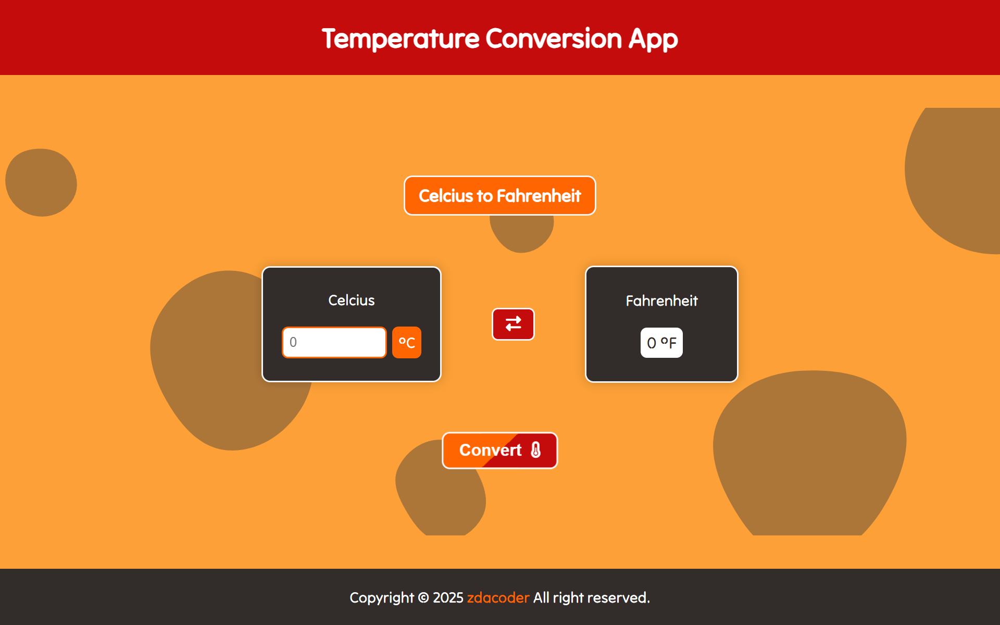

<center>

# Temperature Conversion App (TCA) 🌡️

</center>
<br />

## 📌 Tentang Aplikasi

Temperature Conversion App (TCA) adalah aplikasi berbasis web yang memungkinkan pengguna untuk mengonversi suhu antara Celsius dan Fahrenheit dengan mudah.

<br>

## 👨‍💻 Pembuat

- Github: [zdacoder](https://github.com/MuchamadZainuri)

- LinkedIn: [Muchamad Zainuri](http://linkedin.com/in/muchamadzainuri)

<br />

## 🛠️ Teknologi yang Digunakan

  
  
  

<br />

## 🎯 Fitur Aplikasi

- Mengonversi suhu dari Celsius ke Fahrenheit
- Mengonversi suhu dari Fahrenheit ke Celsius
- Menampilkan hasil konversi suhu secara real-time
- Menampilkan Penjelasan singkat tentang cara kerja konversi suhu tersebut

<br />

## 🚀 Cara Menggunakan Aplikasi

1. Masuk ke [Temperature Conversion App](https://revou-fundamental-course.github.io/TCA/)
2. Masukkan suhu dalam Celsius atau Fahrenheit yang ingin Anda konversi
3. Pilih jenis suhu yang ingin Anda konversi (Celsius ke Fahrenheit atau Fahrenheit ke Celsius)
4. Hasil konversi suhu akan ditampilkan secara real-time di layar
5. Untuk informasi lebih lanjut tentang cara kerja konversi suhu, klik tombol "Result Explanation"
6. Untuk mengulang konversi suhu, klik tombol dengan ikon panah melingkar (reset)

<br />

## 🖥️ Instalasi Aplikasi Secara Lokal

Untuk menginstal aplikasi ini secara lokal, Anda memerlukan beberapa alat berikut:

- **Live Server**
- **Code Editor (seperti Visual Studio Code)**
- **Browser (seperti Google Chrome atau Mozilla Firefox)**

### Langkah-langkah Instalasi

1. Clone repositori ini ke dalam direktori lokal Anda:

   ```bash
   git clone https://github.com/revou-fundamental-course/03-feb-25-MuchamadZainuri.git
   ```

2. Buka direktori proyek dengan Code Editor Anda.
3. Pastikan Anda telah menginstal ekstensi Live Server pada Code Editor Anda.
4. Jalankan Live Server untuk memulai aplikasi secara lokal.
5. Buka browser Anda dan navigasikan ke `http://localhost:5500` (atau port lain yang ditentukan oleh Live Server).

<br />

## 📸 Tangkapan Layar Aplikasi

Berikut adalah tangkapan layar dari halaman aplikasi:


